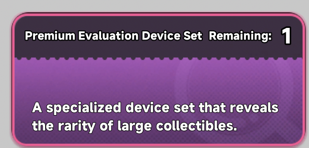

# NTE-AuctionValuePredict

Kalkulator sederhana untuk memprediksi batas aman (safe bid) saat lelang, berdasarkan jumlah item purple, gold, dan red.

## Cara kerja

1. Hitung total item purple + gold + red yang ada.
2. Hitung total item purple.
3. Total gold + red = (purple + gold + red) − total purple.
4. Total Auction Value = total gold + red × harga rata-rata gold (default Rp50.000, bisa disesuaikan kalau kamu tahu harga rata-rata yang lebih akurat).
5. Jangan bid melebihi angka safe bid ini.

# Pack yang harus di beli

# Device Yang Di gunakan

## Web
[Buka Web ini](https://staryuu1.github.io/NTE-AuctionValuePredict/)

## cara Pakai
1. Input Total item purple,gold dan red (dari daffodil)
2. Input total purple (gunakan  purple-rarity Count  device)
3. lalu akan muncul total value (asumsi)
4. jika sudah round2 input average gold value (gunakan gold raritu average value device)
5. Maka akan muncul value item lelang sekarang (tidak 100% akurat tapi mendekati)

## Note
* Setiap ronde harus membeli pack ulang karena devices hanya 1x pakai peronde
* Total Value Hasil Kalkulasi Merupakan Skenario terburuk, jadi ada kemungkinan Total Value Bisa lebih Besar dari hasil kalkulasi (atau lebih kecil)

## Credit

Terinspirasi dari sebuah [postingan Facebook](https://web.facebook.com/share/p/1915QnrjYs/). Silakan Cek Original Post ya (bukan ide saya)
