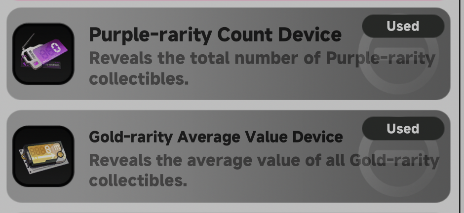

# NTE-AuctionValuePredict

Kalkulator sederhana untuk memprediksi batas aman (safe bid) saat lelang, berdasarkan jumlah item purple, gold, dan red.

## Cara kerja

1. Hitung total item purple + gold + red yang ada.
2. Hitung total item purple.
3. Total gold + red = (purple + gold + red) − total purple.
4.Total Auction Value = total gold + red × harga rata-rata gold (default Rp50.000, bisa disesuaikan kalau kamu tahu harga rata-rata yang lebih akurat).
5. Jangan bid melebihi angka safe bid ini.

## Device yang Di gunakan Di lelang

## Web
[Buka Web ini](https://staryuu1.github.io/NTE-AuctionValuePredict/)

## Credit

Terinspirasi dari sebuah [postingan Facebook](https://web.facebook.com/share/p/1915QnrjYs/).
